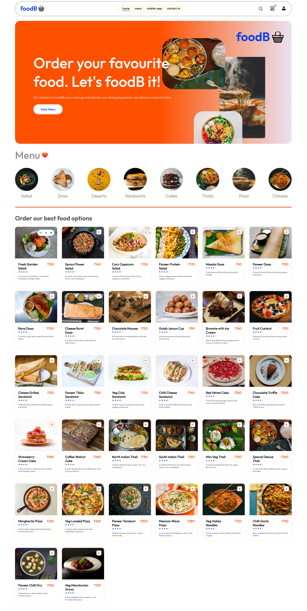

## 🍽️ User Features

- 🔐 **User Registration & Login**
- 🍔 **Browse Restaurants & Menus**
- 🛒 **Add to Cart & Checkout**
- 📦 **Track Order Status**

---

## 🛠️ Admin Features

- 🏪 **Add / Update Restaurants**
- 🍛 **Manage Food Items**
- 📋 **Manage Orders**
- 👤 **Manage Users**

---

## ⚙️ Backend Setup

To run the backend correctly, create a **.env** file and add the following variables:
JWT_SECRET=your-secret-key
DB_URL=your-mongodb-connection-url

## 🖼️ Project Screenshot

